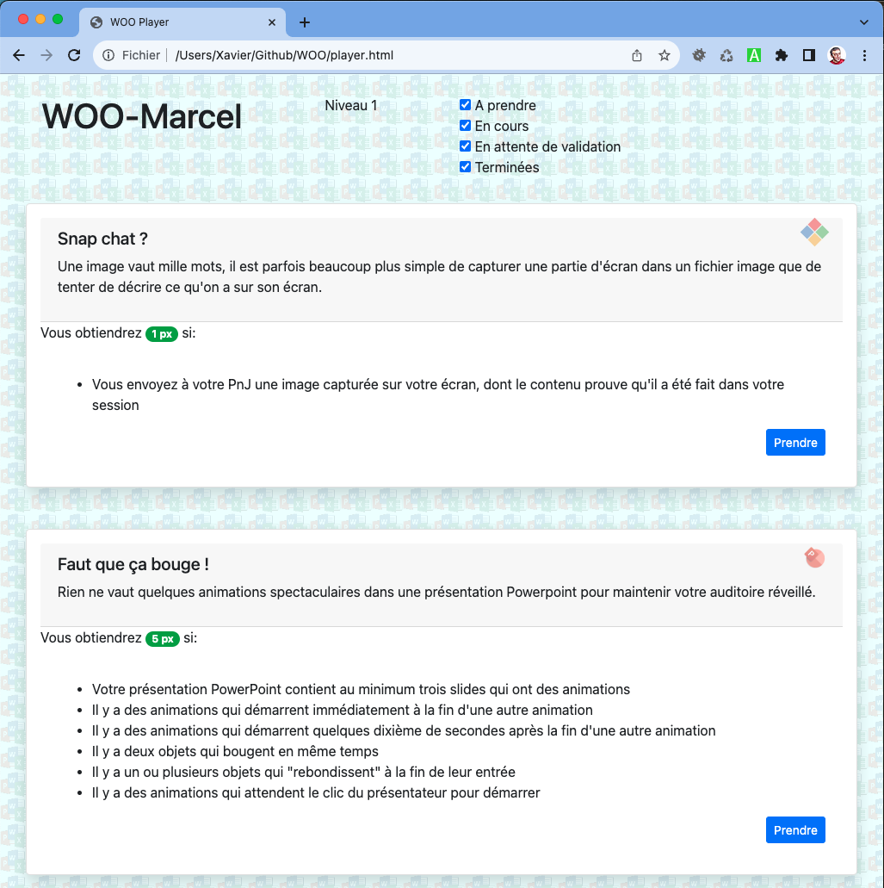

# Configuration d'un joueur WOO

- Connectez-vous à etml.icescrum.com (créez un compte si nécessaire)
- Assurez-vous avec votre PnJ que vous avez bien été intégré dans l'équipe WOO 
- Créez un projet WOO-xxx, où xxx est votre prénom (plus une lettre de votre nom si - besoin), dans lequel:
  - L'estimation des efforts est désactivée
  - L'état 'In Review' du Story Workflow est activé
  - Votre PnJ est un Product Owner
  - Il y a une release nommée "P_OFFICE" et dont les dates correspondent avec le - trimestre
  - Il y a un sprint activé (les dates sont sans importance)
- Créez un token nommé 'WOO' dans votre compte
- Avec Git, clonez https://github.com/ETML-INF/WOO
- Renommez le fichier `icescrum_api.js.example` en `icescrum_api.js`
- Complétez le fichier icescrum_api.js comme indiqué à l'intérieur de celui-ci

Votre configuration est achevée si vous obtenez quelque chose comme ceci en ouvrant le fichier `Player.html`

